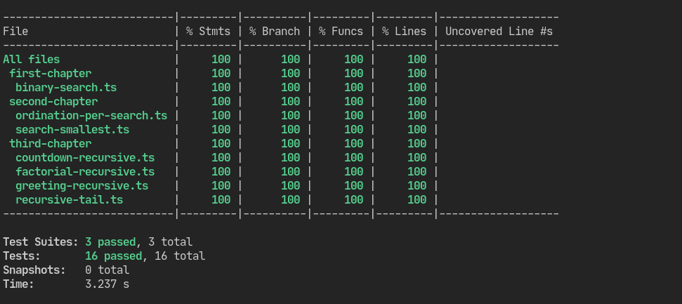

# Grokking Algorithms

> **Notes**, **challenge resolutions**, and **applications** of the Grokking Algorithms book content

## Index

- First Chapter
  - [Anotations](src/first-chapter/notes/)
  - [Chapter Questions](src/first-chapter/chapter-questions/)
  - [Main](src/first-chapter/main.ts)
    - [Binary Search Algorithm](src/first-chapter/binary-search.ts)
- Second Chapter
  - [Anotations](src/second-chapter/notes/)
  - [Chapter Questions](src/second-chapter/chapter-questions/)
  - [Main](src/second-chapter/main.ts)
    - [Ordination Per Search](src/second-chapter/ordination-per-search.ts)
    - [Search Smallest](src/second-chapter/search-smallest.ts)
- Third Chapter
  - [Anotations](src/third-chapter/notes/)
  - [Chapter Questions](src/third-chapter/chapter-questions/)
  - [Main](src/third-chapter/main.ts)
    - [Countdown Recursive](src/third-chapter/countdown-recursive.ts)
    - [Greeting Recursive](src/third-chapter/greeting-recursive.ts)
    - [Factorial Recursive](src/third-chapter/factorial-recursive.ts)
    - [Recursive Tail Call](src/third-chapter/recursive-tail.ts)

## Testing

All sections are tested with the [`jest`](https://jestjs.io/) testing framework.

### Coverage

---

  Developer with ❤️‍🔥 by Lucas Souza (@deverebor)

